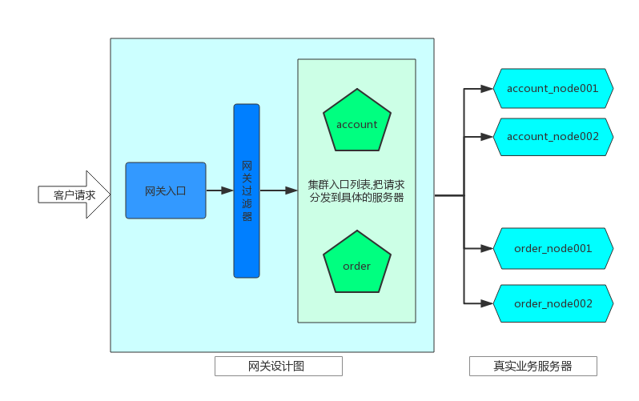

# **api go-gateway**

ApiGateway 网站服务网关看了很多实现，大多数的实现需要配置比较多，所以这里创建一个网关尽量减少配置的数据，减少部署的压力

关键点在于ApiGateway上不需要配置任何url映射，只要给每个服务定一个名字，客户端在请求时会附带这个名字，网关根据这个名字然后把请求转发到具体的服务器上
(比如: http://example.com/myRequestURI?service=ServiceName)。

这样便减少了大量的url配置流程。网关的日志统计依然可以正常进行。

####**源码目录介绍**
    
    /data 网关的配置数据
    
    /filter 过滤器实现，在请求转发前，对请求进行过滤操作
    
    /gateway 启动http服务器，并解析配置数据，构造网关数据结构
    
    /proxy 请求转发代理,把用户的请求转发具体的业务服务器上
    
    /service 集群和服务的实现

####**整体架构图**
